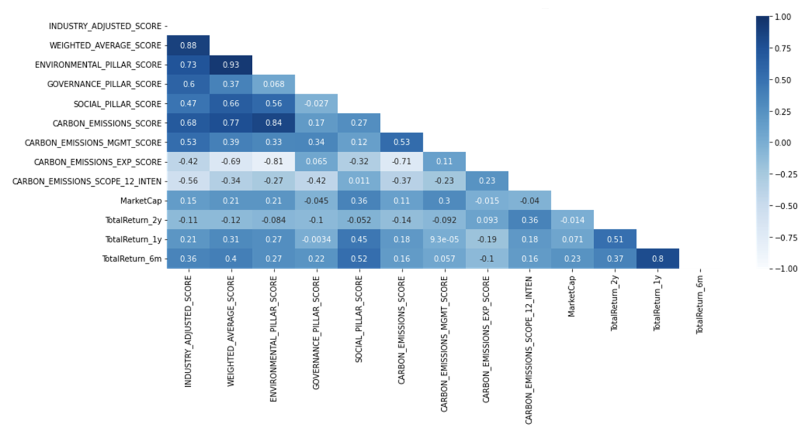
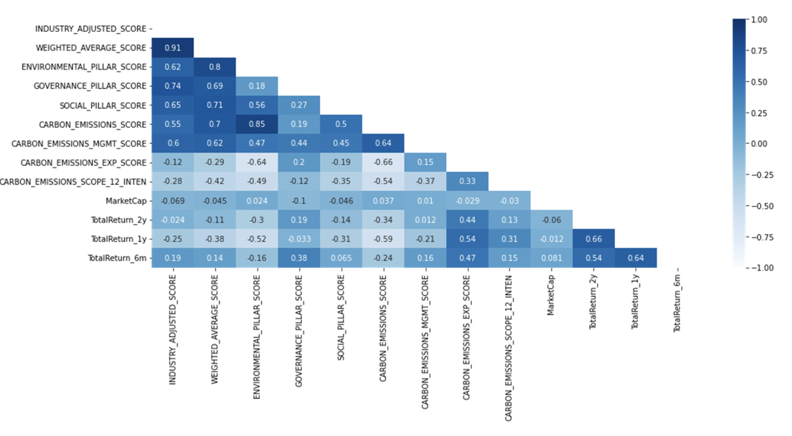

<style>
    body { background-color: #A9CAAB; }
    pre, pre:not([class]) { background-color: gainsboro; }
</style>

```{r setup, include=FALSE}
knitr::opts_chunk$set(echo = FALSE, warning = FALSE, message = FALSE)
library(tidyverse)
library(readxl)
library(caret)
library(tidyverse)
library(rpart)
library(rpart.plot)
library(rsample) 
library(randomForest)
library(modelr)
library(corrplot)
library(sf)
library(rnaturalearth)
library(rnaturalearthdata)
library(DT)
library(glmnet)

# read in the file, only usign esg_df (the larger set)
esg_df<- read_excel("data/ACWI-ESG-Results_1.xlsx")
esg_uni_df <-read_excel("data/ACWI-ESG-Universal-Results_1.xlsx")

# override the default setting of ggplot
theme_set(theme_minimal())
```

### 摘要
這份報告考慮多項因子，包含ESG評分, E向度分數，S向度分數, G向度分數, 碳排放曝險指數、碳排放管理指數、碳排放綜合分數、碳排放總量等。我們針對各項因子去做單因子分析，並取其中幾項因子與股價報酬做迴歸分析，並且去檢驗此模型，驗證該迴歸分析的有效性，觀察這些因子在迴歸分析下與股價的相關性。

### 使用套件與資源包概念解說 {.tabset}
#### tidyverse
是一個匯總包，可以從數據探索到數據視覺化，集合了ggplot2、dplyr、stringr、tidyr等安裝包

#### ggplot2
數據可視化繪圖包。
ggplot2允許用戶在更抽象的層面上增加、刪除或轉換圖表中的元素。
但這種抽象化的代價是執行速度。ggplot2較lattice繪圖包而言更耗時。

#### dplyr
榮入很多概念與結構化查詢語言（Structured Query Language，SQL）相仿的函數，搭配 %>% 運算子一起使用

#### datatable
是表格套件的一種，DataTables套件是一種JQuery外掛套件，特別針對table此種資料的呈現方式，內部已實作了各種相關操作的功能，並提供具有彈性的客製化選項，開發人員只需要下載並引用相關函式庫，即可輕鬆實作出功能豐富的table介面。

#### training與testing
回歸模型當中訓練集與測試集，在完成模型訓練後，為了驗證模型訓練的好不好，需要用一組獨立的測試資料，來做模型的驗證

#### Regression analysis
迴歸分析主要用在了解兩個或多個變數間是否相關、相關方向與強度，並建立數學模型以便觀察特定變數來預測研究者感興趣的變數。

#### sapply
以矩陣行是來展現表格，是apply套件的一種


### 研究主題
碳排放管理對於企業股價之相關性分析

### 研究動機
近年來，各種以ESG為主題的金融產品如基金、ETF等如雨後春筍般湧出。從一開始作為投資熱潮，到現在偶爾為人所詬病，認為ESG對投資並無助益。

但若從基本面出發對ESG進行探討，為了達到2050年碳中和目標，歐盟已領先全球設立綠色政綱，旗下的三大法規CSRD、TR和SFDR環環相扣，它們將在近三年陸續被落實，互相補足各方的不足部分。CSRD規定企業與金融業必須以透明且統一的標準進行ESG資訊揭露，在SFDR下，金融業需要在進行放貸或設計金融商品時考慮標的物或客戶的永續程度，肩負「讓資金流向永續企業」之責任，這時CSRD所規範的資訊揭露就派上用場，讓企業作為資訊供給者，提供資訊給金融業。當各方都完全服從法規的情況下，整個市場就能達到永續金融目標。

近兩年開始，碳權價格日趨昂貴，在2050碳中和目標下，整體市場將不可避免地邁向零碳經濟，高碳排企業將在這過程中面臨轉型風險，即轉為低碳時可能造成的財務或經營面衝擊。為了評估相關風險，越來越多企業開始發佈TCFD報告書，利用其中所規定的氣候情景分析去衡量轉型風險，國際間也逐漸將TCFD列為法規，包含紐西蘭與英國規定在其國家上市的企業需分別在2023年與2024年發佈TCFD報告書。

除了以上所提到的法規制度，全球正在面臨嚴峻的氣候風險，過去五年美國發生的極端氣候災難事件，已帶來超過6,000億美元的損失，無論是公私部門都明顯感受到氣候風險的壓力、以及改善氣候變遷問題，因此達到2050碳中和目標刻不容緩。

經過以上研究，我們相信在企業所發佈ESG資訊將在近幾年逐漸標準化，比起現今將更能提供投資人有益的資訊。而歐洲作為領先全球制定法規的區域，其企業也將受到規範而必須進行資訊揭露，因此我們希望將樣本池鎖定歐盟企業，且著重於ESG中的碳排放管理指標，期許能夠針對這個課題得出一些新發現。

### 研究方法
利用MSCI ACWI Index 中的歐盟個股與其碳排管理指標，進行單因子迴歸分析，以探討「碳排管理是否能帶來超額報酬」之課題。由於產業間業務性質差異甚大，因此也會將個股按照產業區分，以達到產業中立之目的。

我們大致上會使用的方法與函式如下：

1.linear regression and random forest，比較這兩個模型的性能與差異，並將數據拆分為訓練/測試這兩個方式以進行建模

2.資料當中的carbon emission VS. total return, correlation chart (using y~x) 

3.使用多變數 (use 2y as a try, can switch out Y variable, and/or take out "Industry")

4.繪圖 map plot

5.使用library、filter、sapply、training、testing、ggplot、datatable等套件


#### Data 處理

```{r data cleaning, echo=FALSE, warning=FALSE}
# only using EU countries
esg_eu_df = esg_df %>% filter(ISSUER_CNTRY_DOMICILE %in% c("AT", "BE", "BG", "HR", "CY", "DK", "EE", "FI", "FR", "DE", "GR", "HU", "IE", "IT", "LV", "LT", "LU", "MT", "NL", "PL","PT","RO", "SK", "SI", "ES", "SE"))

# seperate into carb heavt/light and ENERGY data frames
carb_heavy_df = esg_df %>% filter(Industry %in% c("Materials", "Utilities", "Industrial"))
carb_light_df = esg_df %>% 
  filter(!Industry %in% c("Materials", "Utilities", "Energy", "Industrial")) 
energy_df = esg_df %>% filter(Industry %in% c("Energy"))

# chnange "return" variables from character to double
carb_heavy_df[, c(31:33)] <- sapply(carb_heavy_df[, c(31:33)], as.numeric)
carb_light_df[, c(31:33)] <- sapply(carb_light_df[, c(31:33)], as.numeric)
esg_eu_df[, c(31:33)] <- sapply(esg_eu_df[, c(31:33)], as.numeric)
energy_df[, c(31:33)] <- sapply(energy_df[, c(31:33)], as.numeric)

# split the data into train/test for modeling 
set.seed(100)
heavy_split = initial_split(carb_heavy_df, prop = 0.9)
heavy_train = training(heavy_split)
heavy_test = testing(heavy_split)

light_split = initial_split(carb_light_df, prop = 0.9)
light_train = training(light_split)
light_test = testing(light_split)

energy_split = initial_split(energy_df, prop = 0.9)
energy_train = training(energy_split)
energy_test = testing(energy_split)

```


##### 分析與結果

```{r eda, echo=FALSE, warning=FALSE, message=FALSE}

# carb emission VS. total return, correlation chart (using y~x) 
heavy.graph <- ggplot(carb_heavy_df, aes(x=CARBON_EMISSIONS_SCORE, y=TotalReturn_2y))+
  geom_point() + geom_smooth(method="lm", col="red") + ylim(-10, 1000)+ 
  ggtitle("Correlation of Emission Score to Return - Carbon Heavy Industries") + 
  labs(y = "Total Return Rate - 2 years", x = "Carbon Emission Score",) +
  theme(plot.title = element_text(hjust = 0.5, face = "bold"))

light.graph <- ggplot(carb_light_df, aes(x=CARBON_EMISSIONS_SCORE, y=TotalReturn_2y))+
  geom_point()+ geom_smooth(method="lm", col="red") + ylim(-10, 1000)+ 
  ggtitle("Correlation of Emission Score to Return - Carbon Light Industries") + 
  labs(y = "Total Return Rate - 2 years", x = "Carbon Emission Score",) +
  theme(plot.title = element_text(hjust = 0.5, face = "bold"))

energy.graph <- ggplot(energy_df, aes(x=CARBON_EMISSIONS_SCORE, y=TotalReturn_2y))+
  geom_point()+ geom_smooth(method="lm", col="red") + ylim(-10, 1000)+ 
  ggtitle("Correlation of Emission Score to Return - ENergy") + 
  labs(y = "Total Return Rate - 2 years", x = "Carbon Emission Score",) +
  theme(plot.title = element_text(hjust = 0.5, face = "bold"))

# map plot - below is just to build the map
# if need to change anything, visit the below link:
# https://egallic.fr/en/european-map-using-r/

map_eu = esg_eu_df %>%
  group_by(ISSUER_CNTRY_DOMICILE) %>%
  summarise(avg_score = mean(CARBON_EMISSIONS_SCORE))

map_eu$country = c("Austria","Belgium","Germany","Denmark","Spain","Finland","France","Greece","Hungry", "Ireland","Italy","Luxembourg","Netherlands","Poland","Portugal","Sweden")

world_map <- ne_countries(scale = 50, returnclass = 'sf')
european_union <- c("Austria","Belgium","Bulgaria","Croatia","Cyprus",
                    "Czech Rep.","Denmark","Estonia","Finland","France",
                    "Germany","Greece","Hungary","Ireland","Italy","Latvia",
                    "Lithuania","Luxembourg","Malta","Netherlands","Poland",
                    "Portugal","Romania","Slovakia","Slovenia","Spain",
                    "Sweden","United Kingdom")

european_union_map <- world_map %>% 
  filter(name %in% european_union)

bbox_europe <- st_bbox(c(xmin = -10, ymin = 20, xmax = 50, ymax = 80), crs = st_crs(european_union_map))
european_union_map_cropped <- st_crop(european_union_map, bbox_europe)

map <- european_union_map_cropped %>% 
  left_join(map_eu, by = c("name" = "country"))

map.graph <- ggplot(data = map) +
  geom_sf(mapping = aes(fill = avg_score)) +
  scale_fill_gradient(name = "Carbon Emission Score", high = "#FF0000FF", low = "#FFFF00FF", na.value = "grey50")+ 
  ggtitle("Carbon Emission Score Across EU") + 
  theme(plot.title = element_text(hjust = 0.5, face = "bold"))

showtable_df = esg_eu_df %>%
  select(TotalReturn_2y, Industry,CARBON_EMISSIONS_SCORE,IVA_COMPANY_RATING, INDUSTRY_ADJUSTED_SCORE,GOVERNANCE_PILLAR_SCORE)

# showing the data frame - important variables 
datatable(showtable_df, options = list(pageLength = 5))
```

#### 一、相關係數熱力圖
```{r pic1-1, dpi=200}

```

對於歐洲企業來説，對E向度曝險程度最高的產業來説，ESG總分、E向度、碳排放這些ESG因子與股價呈現正相關。

解讀：為因為歐洲法規變得嚴格，各家企業的ESG資訊有了透明度和一致性以後，開始成為投資人評斷標的的因素之一。

```{r pic2, dpi=200}

```


能源產業中，碳排曝險分數與報酬率呈現正相關，而碳排總分與報酬率呈現負相關。

解讀：近兩年油價上漲，加上對石油需求提升，能源產業透過提高產能（碳排增加），達到獲利成長。


#### 二、迴歸分析
將各產業劃分為低碳排產業和高碳排產業

```{r corr plots-1, echo=FALSE, warning=FALSE}
# showing plots
heavy.graph
```


```{r corr plots-2, echo=FALSE, warning=FALSE}
# showing plots
light.graph
```


```{r corr plots-3, echo=FALSE, warning=FALSE}
# showing plots
energy.graph
```

#### 2. Avergae Emission Score Across EU

```{r map plot, echo=FALSE, warning=FALSE}
map.graph
```


### Modeling 


```{r all models, echo=FALSE, warning=FALSE}
#######
# linear regression 
#######
# use 2y as a try, can switch out Y variable, and/or take out "Industry"

lr_heavy = lm(TotalReturn_2y ~ IVA_COMPANY_RATING + INDUSTRY_ADJUSTED_SCORE + GOVERNANCE_PILLAR_SCORE + CARBON_EMISSIONS_SCORE + Industry, data = heavy_train)

lr_light = lm(TotalReturn_2y ~ IVA_COMPANY_RATING + INDUSTRY_ADJUSTED_SCORE + GOVERNANCE_PILLAR_SCORE + CARBON_EMISSIONS_SCORE + Industry, data = light_train, na.action=na.omit)

lr_energy = lm(TotalReturn_2y ~ IVA_COMPANY_RATING + INDUSTRY_ADJUSTED_SCORE + GOVERNANCE_PILLAR_SCORE + CARBON_EMISSIONS_SCORE, data = energy_train)

#######
# random forest
#######

forest_heavy = randomForest(TotalReturn_2y ~ IVA_COMPANY_RATING + INDUSTRY_ADJUSTED_SCORE + GOVERNANCE_PILLAR_SCORE + CARBON_EMISSIONS_SCORE + Industry, data = heavy_train, control = rpart.control(cp = 0.002, minsplit=30), importance = TRUE)

forest_light = randomForest(TotalReturn_2y ~ IVA_COMPANY_RATING + INDUSTRY_ADJUSTED_SCORE + GOVERNANCE_PILLAR_SCORE + CARBON_EMISSIONS_SCORE + Industry, data = light_train, control = rpart.control(cp = 0.002, minsplit=30), importance = TRUE, na.action=na.omit)

forest_energy = randomForest(TotalReturn_2y ~ IVA_COMPANY_RATING + INDUSTRY_ADJUSTED_SCORE + GOVERNANCE_PILLAR_SCORE + CARBON_EMISSIONS_SCORE , data = energy_train, control = rpart.control(cp = 0.002, minsplit=30), importance = TRUE, na.action=na.omit)

# predict the yhat by using the "unused" test set 
p_heavy<- predict(lr_heavy, heavy_test)
p_light<- predict(lr_light, light_test)
p_energy<- predict(lr_energy, energy_test)

# Compute errors: difference between predicted and actual test set 
error_heavy <- p_heavy - heavy_test[["TotalReturn_2y"]]
error_light <- p_light - light_test[["TotalReturn_2y"]]
error_energy <- p_energy - light_test[["TotalReturn_2y"]]

# Calculate RMSE
rmse_lm_h =sqrt(mean(error_heavy^2))
rmse_lm_l =sqrt(mean(error_light^2))
rmse_lm_e =sqrt(mean(error_energy^2))

rmse_forest_h = rmse(forest_heavy, heavy_test) 
rmse_forest_l = rmse(forest_light, light_test) 
rmse_forest_e = rmse(forest_energy, energy_test) 
```

#### Model Results {.tabset}
##### 1. Linear Model Result


```{r model report, echo=FALSE, warning=FALSE}
# these are report of linear models
summary(lr_heavy)
summary(lr_light)
summary(lr_energy)
```

從上面的圖片我們可以看出，碳排放分數只在能源行業顯著並係數為負，但這不符合我們預測的，一種可能的原因可能是因為能源行業嚴重依賴燒煤/ gas 這種高碳排放的活動，高碳排放分數意味著較低的產品，導致較低的 2 年總回報。而 這個假設對於碳重工業也可能是相同的，因為它們的碳排放得分係數也是負的。碳排放分數的係數僅在輕碳工業中為正（正如我們所預測的）


##### 2. Random Forest Result

```{r model report-2, echo=FALSE, warning=FALSE}
# report of random forest model
print(forest_heavy)
print(forest_light)
print(forest_energy)

vi = varImpPlot(forest_energy, type=1, main = "Random Forest Variable Importance: Energy")

```
這個區塊使用隨機森林的模型，我們可以從這個變量重要性圖片，從中知道每個變量的重要性，像是碳排放得分是所有“得分”中第二重要的變量。 


```{r rmse, echo=FALSE, warning=FALSE}
# lower RMSE means better moedle performance 
rmse_lm_h
rmse_lm_l
rmse_lm_e
rmse_forest_h
rmse_forest_l
rmse_forest_e
```
這張圖片，我們可以根據它們的均方根誤差 (rmse) 來查看模型的性能，均方根誤差是一種常用的測量數值之間差異的量度 數字越小，模型的性能就越好。 

#### Wrap up
我們可以發現使用隨機森林的模型，性能相較於其他模型還要好。
最後，每個模型都有自己的優點和缺點，都是為了幫助我們了解碳排放分數如何影響總回報，使用模型來查看哪些變量更重要，然後使用線性回歸中的變量，查看它對我們的 Y 變量的實際係數之影響。


### 結論
目前雖然國際間尚未有完整的ESG資訊揭露法規法案，但我們可以從以上結果分析得出，在法規逐步落實的地區（歐洲），ESG評等、碳排放分數與股價呈現正相關，可以間接説明ESG已經開始成為投資決策中重要的一環。

另外，我們發現碳排放指數與股價係數之間有較為明顯的相關性，與輕碳排產業呈現正向關係、與高碳排產業呈現負向關係。可解讀為近一兩年來，油價高漲且對處於製造業循環上升段，對能源、工業、原物料的需求提升，促使這些高碳排產業擴張業務，進而帶動營收成長，因此造成碳排放分數越低（碳排量越高及管理能力越低），股價表現越好的情況。

總結而言，我們可以推測，在法規逐步落實的地區，ESG評等與股價開始有正相關的趨勢。可持續觀察近年這些ESG因子是不是變得更有效，以及企業在面對價格變高的碳費用時是否會面臨成本衝擊，有無辦法把這些費用轉嫁出去，畢竟在成本上升的過程中，獲利將可能被侵蝕，進而影響股價表現。


### 附錄
我們在測試資料的過程中，偶然發現中國企業的股價與ESG相關因子呈現明顯的負相關。

```{r pic1-2, dpi=200}

```

對中國企業來説，ESG分數、E向度分數、G向度分數、S向度分數、碳排放分數皆與近兩年、一年、半年的累積報酬率呈現明顯負相關。（即分數越糟糕，股價表現越好）
解讀：中國股票主要是政策導向概念股，股價波動會被政府政策牽動，且ESG資訊相對於歐洲、美國等國家不透明。


#### 四個問題

##### (1) Where you get your project ideas?
ESG是近幾年的熱門主題，但「ESG選股」是否真的有效是還需要被檢驗的。我們觀察到近三年，歐盟將會陸續制定相關法規，强迫企業進行ESG資訊揭露，因此我們推測「ESG資訊揭露」這件事，將會在近幾年逐步變得透明化且標準化，並逐漸成為選股新趨勢。同時碳市場價格高漲，勢必為企業帶來轉型風險，例如營運成本提升，進而侵蝕獲利等。
因此，我們希望可以針對相關議題探討，期待可以找出一些新發現。

##### (2) What R techniques have been used?
graphical techniques、Quantitative  techniques

##### (3) How many new packages and functions are used?
tidyverse、readxl、caret、rpart.plot、rsample、randomForest、modelr、corrplot、sf、rnaturalearth、rnaturalearthdata、DT、glmnet、ggplot2、dplyr 、datatable、training與testing、Regression analysis、apply

##### (4) What is the most difficult part of your analysis?
ESG議題雖然被討論了很多年，但實際上目前尚未完全受法規管制，國際之間也缺乏通用的揭露標準，步伐最快的歐洲也只會在2024年才會完整落實法規。在這樣的情況下，要想得到各家企業「透明且標準化的ESG資訊」仍有一段很長的距離。而我們處在這個變革的開端，就算是資料庫裏的raw data也是相當雜亂，無論是想要去收集資料，或是考量用何種因子才能取得有效的實證結果，都相當困難，我們能做的就只有透過現在的市場趨勢去預測未來。


